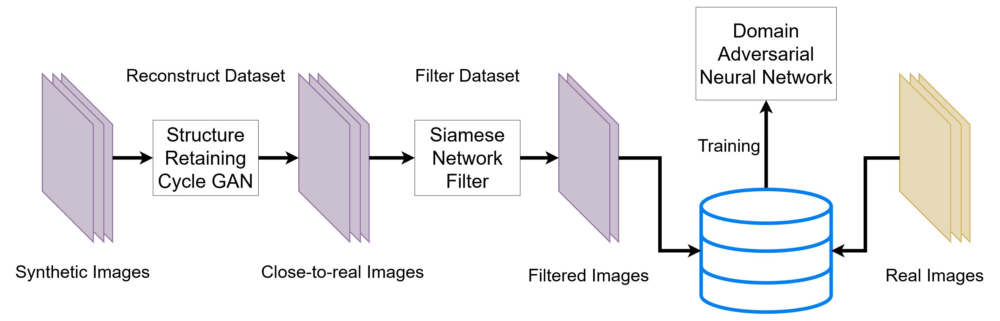
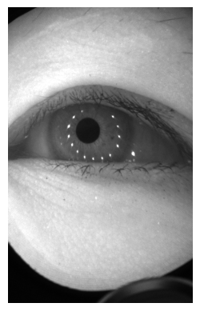
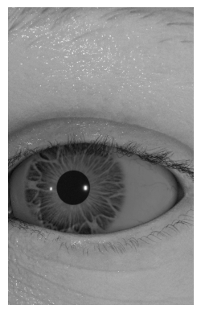
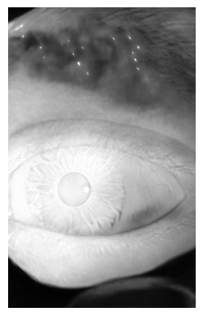
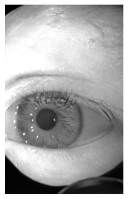

<div align="center">
  </img>
  <p>Overall Architecture</p>
</div>

<p align="center">
  
  
  
  
  
  From left to right: OpenEDS (real), RIT-Eyes (synthetic), CGAN (generated), SRCGAN (generated, ours), SRCGAN-S (generated, ours) datasets.
</p>

# Deep Domain Adaptation: A Sim2Real Neural Approach for Improving Eye-Tracking System

Official Implementation for the paper [Deep Domain Adaptation: A Sim2Real Neural Approach for Improving Eye-Tracking System.](https://doi.org/10.1145/3654703). [Arxiv](https://arxiv.org/abs/2403.15947).

Attempts to broaden the distribution of existing eye image datasets through the inclusion of synthetic eye images have found that a model trained on synthetic images will often fail to generalize back to real-world eye images (in eye image segmentation context).

We use dimensionality-reduction and deep learning techniques to measure the overlap between the target eye images and synthetic training data, and to prune the training dataset in a manner that maximizes distribution overlap. We demonstrate that our methods result in robust, improved performance when tackling the discrepancy between simulation and real-world data samples, **crucially reduce the gap between synthetic and real datasets**.

Should you have any question, please contact the corresponding author Viet Dung Nguyen at his institutional email address.


## Prerequisites
* Operating System: Linux
* Anaconda
* Running the installation script: `bash install.sh`


## Running The Experiment

* NOTE: all files in `rc` folder is specifically designed to train the models on Rochester Institute of Technology's Research Cluster with each training instance using one A100 GPU and train over the period of 3 days.

* Download OpenEDS and RITEyes dataset, unarchive them and put inside the data folder, e.g., `/data`
* configure the correct path for the folder and extract both dataset to h5 file: `python extractor.py`
  * The filename of the h5 file containing OpenEDS data is `open_eds_real.h5`
  * The filename of the h5 file containing RIT-Eyes data is `rit_eyes.h5`

* Train 64 different version of Structure Retaining CycleGAN models on slurm system: `bash rc/srcgan_train.sh`
  * Basically, if you want to run a single training instance:
    ```bash
    python srcgan_train.py \
        -l logs/srcgan \
        -e example_training_instance \
        --source_domain data/rit_eyes.h5 \ # NOTE: config the path to the right h5 file
        --target_domain data/open_eds_real.h5 \ # NOTE: config the path to the right h5 file
        --batch_size 2 \
        --gamma_edge 0.1 \
        --gamma_mean 0.1 \
        --gamma_var 0.1
    ```

* Train raw RITNet first: `bash rc/ritnet_raw_train.sh`
  * Locally (check the log in the log root folder that you have specified):
    ```bash
    python train_ritnet_only.py \
      -l logs/pop \
      -e my_ritnet \
      --dataset_path /data/open_eds_real.h5 \ # NOTE: config the path to the right h5 file
      --val_dataset_path /data/open_eds_real.h5 \ # NOTE: config the path to the right h5 file
      --batch_size 8 \
      --use_lr_scheduler
    ```
* Train siamese networks: `python siamese_train.py -l ./logs/siamese -e my_siamese --source_domain /data/new_rit_eyes/rit_eyes.h5 --target_domain /data/open_eds_real.h5`

* Export all datasets: including 64 different cgan versions, with and without siamese filters: `bash rc/reconstruct_filter_stats.sh`
  * Export miou for all cgans using pure ritnet
  * Export Cgan vectors
  * One can run locally by executing:
    ```bash
    python reconstruct_filter_stats.py \
      -l logs/dda_pipeline/cgan_export \
      -e my_expname \
      --target_path logs/dda_pipeline/cgan_export/my_expname/cycled.h5 \ # NOTE: config the right path here
      --model_directory logs/dda_pipeline/srcgan/my_structure_retaining_cycle_gan_exp_folder/checkpoints \ # NOTE: config the right path here
      --source_domain data/rit_eyes.h5 \ # NOTE: config the right path here
      --batch_size 2 \
      --sia_filter \
      --target_domain data/open_eds_real.h5 \ # NOTE: config the right path here
      --sia_weights_path logs/dda_pipeline/siamese/sia_4/checkpoints/sia_4.pth \
    ```

* Decide on the best Structure Retaining CycleGAN version and export dataset using `bash rc/make_desired_cycled.sh` using desired hyperparameters combination.
  * The filename of CGAN, SRCGAN, SRCGAN-S dataset will be `orig_cgan.h5`, `cycled_synth.h5`, `cycled_synth_filter.h5`, respectively. One can also confirm them in `rc/make_desired_cycled.sh`

* Finally, train both RITnet and Domain Adversarial Neural Network using `bash rc/train_model_population_and_stats_mix_dataset.sh` and `bash rc/train_model_population_and_stats_single_dataset.sh` to train DANN and RITnet on mixed datasets (both real and synthetic images in the training set) and single dataset (only synthetic images in the training set). The training instances will have the following choice/switch
  * Ritnet or DANN
  * Reconstruct (Cgan) or non-reconstruct(rit_eyes)
  * Filter (siamese) or non-filter (no siamese)
  * different number of images trained
  * Specifically, to train an RITnet model with single source dataset (only synthetic) locally, one can execute:
    ```bash
    python train_ritnet_only.py \
      -l logs/dda_pipeline/pop2 \
      -e my_expname \
      --n_folds 10
      --fold 3
      --dataset_path /home/vn1747/data/cycled_synth.h5 # NOTE: config the right path here
      --val_dataset_path /home/vn1747/data/open_eds_real.h5 # NOTE: config the right path here
      --batch_size 8
      --epochs 200
      --n_limit 1024
    ```
  * Another example of training DANN under a mixed dataset (source and target dataset), the source dataset can be (CGAN, SRCGAN, SRCGAN-S):
    ```bash
    python train_dann_mix.py \
      -l logs/dda_pipeline/pop2 \
      -e my_expname \
      --n_folds 10
      --fold 2
      --n_real_limit 8192
      --n_synth_limit 8192
      --source_domain /home/vn1747/data/cycled_synth_filter.h5 # NOTE: config the right path here
      --target_domain /home/vn1747/data/open_eds_real.h5 # NOTE: config the right path here
      --batch_size 8
      --epochs 100
    ```

## Citation

* Bibtex:
```bibtex
@article{Nguyen2024DeepDomainAdaptation,
  author = {Nguyen, Viet Dung and Bailey, Reynold and Diaz, Gabriel J. and Ma, Chengyi and Fix, Alexander and Ororbia, Alexander},
  title = {Deep Domain Adaptation: A Sim2Real Neural Approach for Improving Eye-Tracking Systems},
  year = {2024},
  issue_date = {May 2024},
  publisher = {Association for Computing Machinery},
  address = {New York, NY, USA},
  volume = {7},
  number = {2},
  url = {https://doi.org/10.1145/3654703},
  doi = {10.1145/3654703},
  abstract = {Eye image segmentation is a critical step in eye tracking that has great influence over the final gaze estimate. Segmentation models trained using supervised machine learning can excel at this task, their effectiveness is determined by the degree of overlap between the narrow distributions of image properties defined by the target dataset and highly specific training datasets, of which there are few. Attempts to broaden the distribution of existing eye image datasets through the inclusion of synthetic eye images have found that a model trained on synthetic images will often fail to generalize back to real-world eye images. In remedy, we use dimensionality-reduction techniques to measure the overlap between the target eye images and synthetic training data, and to prune the training dataset in a manner that maximizes distribution overlap. We demonstrate that our methods result in robust, improved performance when tackling the discrepancy between simulation and real-world data samples.},
  journal = {Proc. ACM Comput. Graph. Interact. Tech.},
  month = {may},
  articleno = {25},
  numpages = {17},
  keywords = {Deep learning, Domain adaptation, Eye segmentation, Eye-tracking, Generative modeling}
}
```

* ACM Reference Format:

```txt
Viet Dung Nguyen, Reynold Bailey, Gabriel J. Diaz, Chengyi Ma, Alexander Fix, and Alexander Ororbia. 2024. Deep Domain Adaptation: A Sim2Real Neural Approach for Improving Eye-Tracking Systems. Proc. ACM Comput. Graph. Interact. Tech. 7, 2, Article 25 (May 2024), 17 pages. https://doi.org/10.1145/3654703
```
